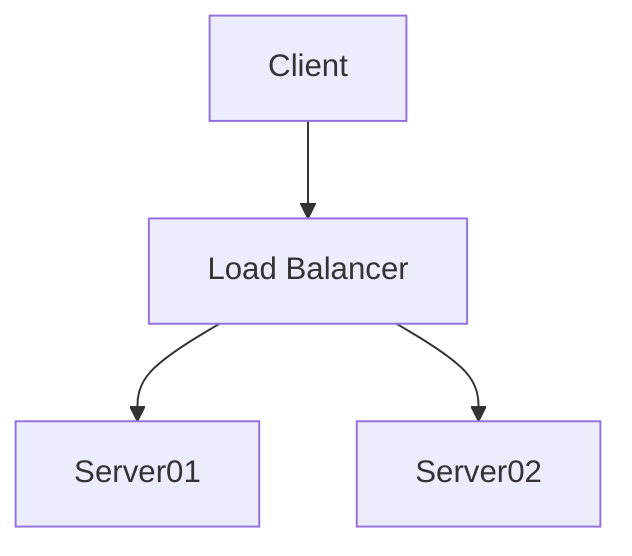

# Proteus

## Test Diagram
You sometimes have to refresh to get diagrams to render

## Test tabs
=== "Tab 1"
    Markdown **content**.

    Multiple paragraphs.

=== "Tab 2"
    More Markdown **content**.

    - list item a
    - list item b
